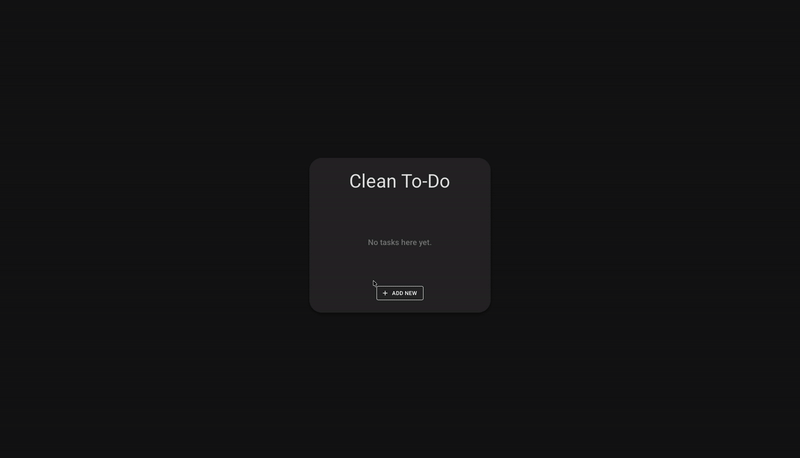
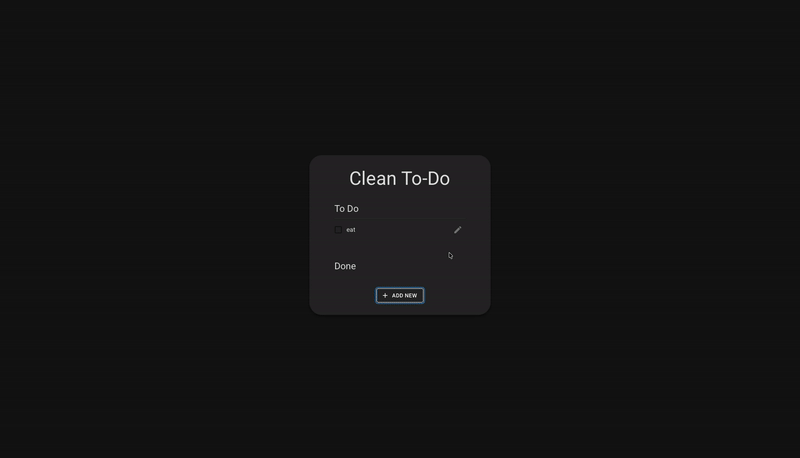
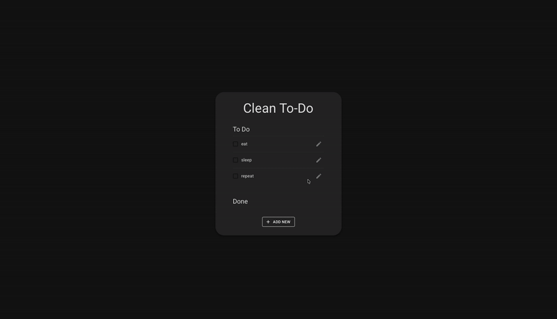
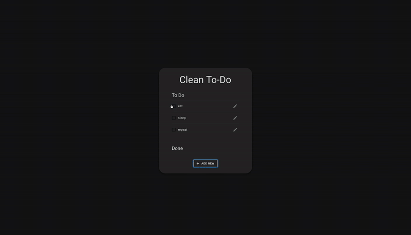

# 🧼 Clean To-Do

A simple, modern, and persistent to-do list app built with **React** and **Material UI**.
Your tasks automatically save in **localStorage**, so nothing is lost even after a refresh.

---

## 🚀 Features

- 📝 Add, edit, and delete tasks
- ✅ Mark tasks as done or move them back to To-Do
- 💾 Automatic saving using localStorage
- 🎨 Clean UI built with Material UI components
- ⚡ Responsive and lightweight

---

## ⚙️ Key Functions

### Add new tasks using the modal interface



### Edit existing tasks and update their text



### Delete tasks directly from the edit modal



### Mark tasks as completed or move them back to To-Do



### Automatically save and load tasks using localStorageedi

---

## 🧰 Tech Stack

- **React**
- **Material UI (MUI)**
- **localStorage**
- **Vite**

---

## 📦 Installation

Clone the repository, install dependencies and run:

```bash
npm install
npm run dev
```
